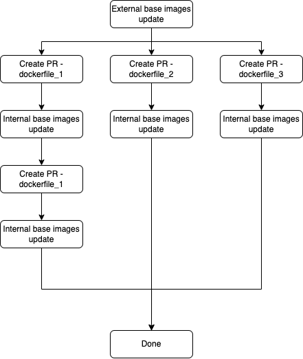

## Auto docker file update
The auto update dockerfiles flow includes:
 - github actions flow files:
   - create-update-dockerfiles-PR.yml
   - update-external-base-images.yml
   - update-internal-base-images.yml
 - python scripts:
   - get_dockerfiles.py
   - get_latest_tag.py
   - update_dockerfiles.py
 
### Github workflows
- #### Update external base images
   For each docker file with external base image.
  
   external base image - images that are not from the demisto's dockerfiles repository:
  
  1. Check for new minor or micro updates, for example ```alpine-3.14``` will search for new tags from the format ```alpine-3.X```.
  Note: for ```alpine-3.14-python-3.9.1``` the script will update only if all the versions are equal or greater.
  2. If there is a new image, or the latest image was updated, the script will create a new branch and will update the docker file with the latest tag and date.
   
- #### Update internal base images
   For each docker file with internal base image.
  
   internal base image - images that are from the demisto's dockerfiles repository:
  
  1. Get all the dockerfiles that are used as based image on other dockefiles.
  2. For each docker file get the latest tag from the docker registry   
  3. If there is a new tag, updates all the dependant images in batches. For each batch crates a branch and push the relevant updates.
   
- #### Create update dockerfiles PR
   For each branch created by the previous actions, this workflow will automatically create a dedicated pull request.
   
### General flow

1. The *Update external base images* action runs once a day, and creates a branch for each external docker image that had updates.
2. The *Create update dockerfiles PR* action identifies the new branches and creates a PR for each new branch.
3. Once PR is merged, the *Update internal base images* action automatically runs and creates a branch for each outdated internal docker image.
4. The *Create update dockerfiles PR* action identifies the new branches and creates a PR for each new branch.
5. Once PR is merged, step 3 runs again. This loop will continue until there are no more files to update.

